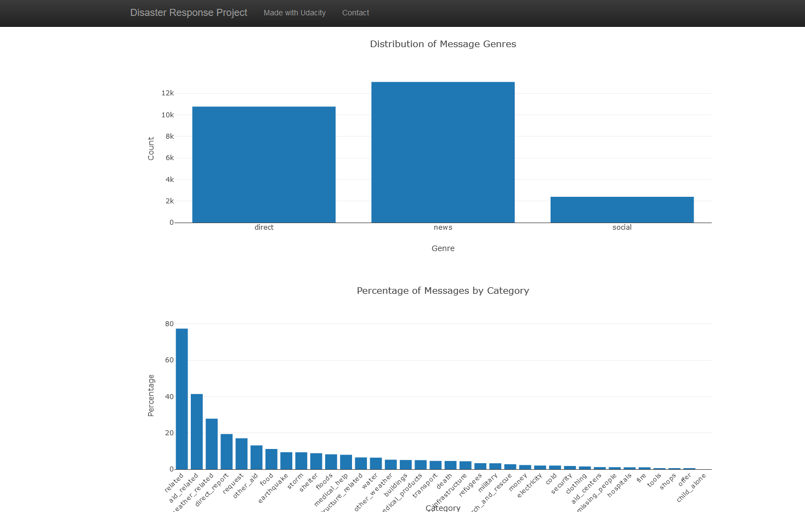
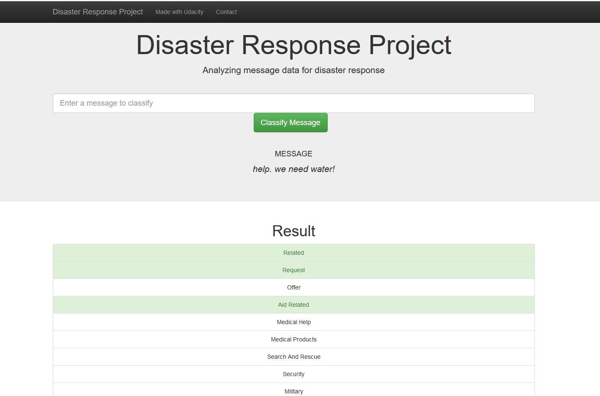

# Udacity_Project_2

## Motivation

This project aims to analyze disaster data, by 
- building an ETL pipeline to extract, clean, and store the data in a SQLite database
- creating a machine learning pipeline to categorize real messages that have been sent during disaster events
- developing a web app to classify a new incoming disaster message in several categories and vizusalize the model results

## Installation

For this project, I've have used Python 3.7.3 and the following Python libraries:

- pandas==1.1.3
- SQLAlchemy==1.3.5
- json5==0.9.5
- plotly==4.5.0
- gzip-reader==0.1
- nltk==3.6.2
- Flask==2.0.0  
- sklearn==0.0
- regex==2020.2.20
- pickleshare==0.7.5

Please read the [instructions](workspace/README.md) to execute the program.

## File Description:

- [ETL Pipeline Preparation.ipynb](ETL%20Pipeline%20Preparation.ipynb) and [process_data.py](workspace/data/process_data.py): ETL pipeline
- [ML Pipeline Preparation.ipynb](ML%20Pipeline%20Preparation.ipynb) and [train_classifier.py](workspace/models/train_classifier.py): machine learning pipeline
- [run.py](workspace/app/run.py): web app

## Results of Web App

## Acknowledgement

This project has been created as part of the [Udacity Data Science Nanodegree](https://www.udacity.com/course/data-scientist-nanodegree--nd025).
The data is provided by Figure Eight.

